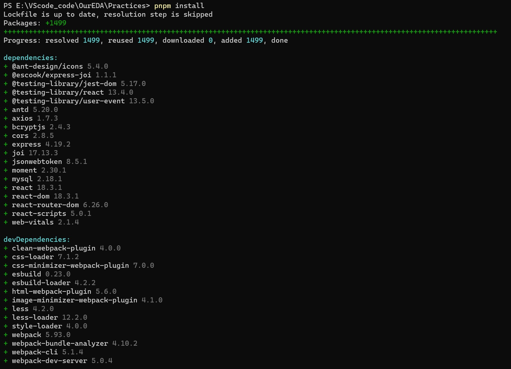
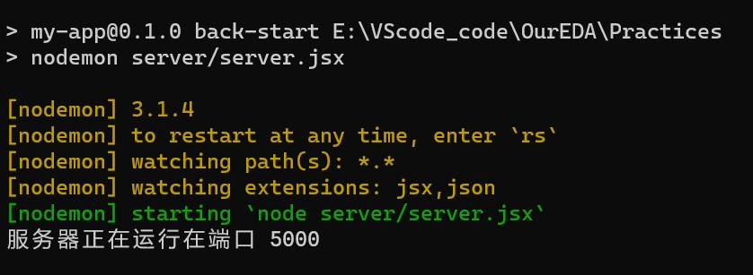
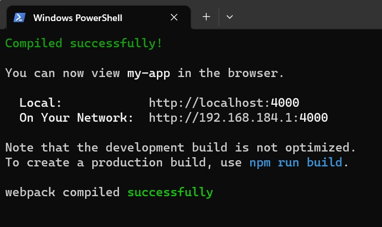
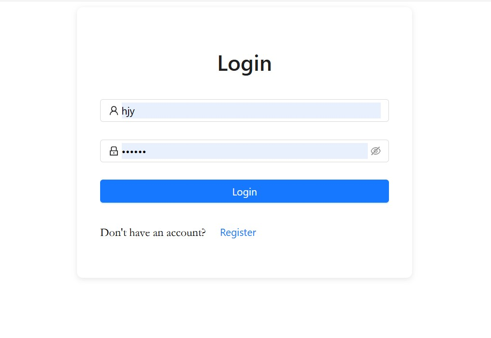

## README

[TOC]

### ToDoList项目概述

#### 1.技术栈

**React**: 用于构建用户界面的 脚手架

**Axios**: 用于发送 HTTP 请求

**React Router**: 实现前端路由

**Ant Design**: 组件库

#### 2.配置相应的包(node_modules)

1.克隆仓库到本地

`git clone https://github.com/FanZDStar/ToDo-List.git`

2.打开package.json查看配置。

```json

{
  "name": "my-app",
  "version": "0.1.0",
  "private": true,
  "dependencies": {
    "@ant-design/icons": "^5.4.0",
    "@escook/express-joi": "^1.1.1",
    "@testing-library/jest-dom": "^5.17.0",
    "@testing-library/react": "^13.4.0",
    "@testing-library/user-event": "^13.5.0",
    "antd": "^5.20.0",
    "axios": "^1.7.3",
    "bcryptjs": "2.4.3",
    "cors": "^2.8.5",
    "express": "^4.19.2",
    "joi": "^17.13.3",
    "jsonwebtoken": "8.5.1",
    "moment": "^2.30.1",
    "mysql": "^2.18.1",
    "react": "^18.3.1",
    "react-dom": "^18.3.1",
    "react-router-dom": "^6.26.0",
    "react-scripts": "5.0.1",
    "web-vitals": "^2.1.4"
  },
  "scripts": {
    "start": "set PORT=4000 && react-scripts start",
    "build": "react-scripts build",
    "test": "react-scripts test",
    "eject": "react-scripts eject",
    "fro-build": "webpack",
    "back-start": "nodemon server/server.jsx",
    "start:prod": "pnpm run build:frontend && pnpm run start:backend"
  },
  "browserslist": {
    "production": [
      ">0.2%",
      "not dead",
      "not op_mini all"
    ],
    "development": [
      "last 1 chrome version",
      "last 1 firefox version",
      "last 1 safari version"
    ]
  },
  "devDependencies": {
    "clean-webpack-plugin": "^4.0.0",
    "css-loader": "^7.1.2",
    "css-minimizer-webpack-plugin": "^7.0.0",
    "esbuild": "^0.23.0",
    "esbuild-loader": "^4.2.2",
    "html-webpack-plugin": "^5.6.0",
    "image-minimizer-webpack-plugin": "^4.1.0",
    "less": "^4.2.0",
    "less-loader": "^12.2.0",
    "style-loader": "^4.0.0",
    "webpack": "^5.93.0",
    "webpack-bundle-analyzer": "^4.10.2",
    "webpack-cli": "^5.1.4",
    "webpack-dev-server": "^5.0.4"
  }
}

```

进入项目根目录，打开终端，输入`npm install` 或者`pnpm install `，会按照packjson安装你的dependencies，如下图



然后直接启动`npm start` 或者`pnpm start`，这个项目会启动于4000端口，您也可以修改至其他端口，修改packjson中第27行即可`start": "set PORT=4000 && react-scripts start`,修改数字为你想要的端口数即可，例如4001或者4002(但是不要是5000)。

Ctrl+C键先关闭react项目的运行（没错你没看错，就是复制的那个）

#### 3.启动项目

1.先启动后端服务器`pnpm run back-start ` ，终止是键盘ctrl+c



证明你已经成功启动，这就是为什么我建议你不要在5000中启动前端react代码，会造成端口冲突。

2.启动前端代码`pnpm start `，终止是键盘ctrl+c

[^启动前端代码`pnpm start `，终止是键盘ctrl+c]:注意：先新建一个终端，也是进入根目录，再输入命令




证明你已经成功启动前端代码，你应该能看到如下登录界面：



#### 4.建立你的对应数据库

在文件

`./server/server.jsx` 中如下代码：

```jsx
const pool = mysql.createPool({
    connectionLimit: 10, // 连接池中最大连接数
    host: 'localhost',
    user: 'root',
    password: 'xxxxxx',
    database: 'xxxxxx'
});
```

修改成您自己的数据库，数据库下新建users的表，sql语句如下:

`create table users
(
    id       int auto_increment
        primary key,
    username varchar(255) not null,
    password varchar(255) not null
);`

新建好了，就可以启动前端和后端服务器，然后就可以开始你的操作啦！

#### 5.webpack打包

根目录下终端输入命令`pnpm run fro-build`即可，打包完成后出现一个dist文件夹，打开index.html即可。

### 功能介绍

- **用户认证**

- 用户注册和登录功能。

  登录后可管理专属于自己的待办任务。

- **任务管理**
  
  **查询任务**: 登录后查看自己的所有任务。
  
  **添加任务**: 创建新的待办任务。
  
  **更新任务**: 修改任务的状态。
  
  **删除任务**: 删除不需要的任务。